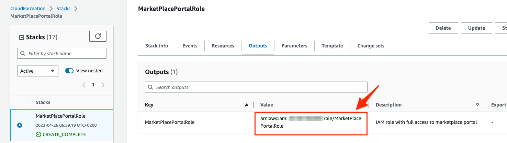

# AWS Marketplace Portal IAM Access Solution

Manage Marketplace portal listings using an IAM role deployed by this CFT

# Description
This template create a trust relationship between an AWS account where you manage your AWS Marketplace Subscriptions (Account A) and another "jump account" (Account B).

After deployment you can access the Account A by switch role from the Account B.

# Usage

1. Click to deploy [Quick Create Stack](https://us-east-1.console.aws.amazon.com/cloudformation/home?region=eu-central-1#/stacks/quickcreate?templateUrl=https%3A%2F%2Fstorm-fsi-solutions.s3.amazonaws.com/marketplace-portal-iam-access/marketplace-management-FSI-template.json&stackName=MarketPlacePortalRole&param_AWSRegion=eu-central-1) in your Marketplace Account

1. You will need the name of the role and the destination Account Id (Account A), to switch the role from your source account (Account B). You will find both values in the ARN inside the output section as displayed below.

